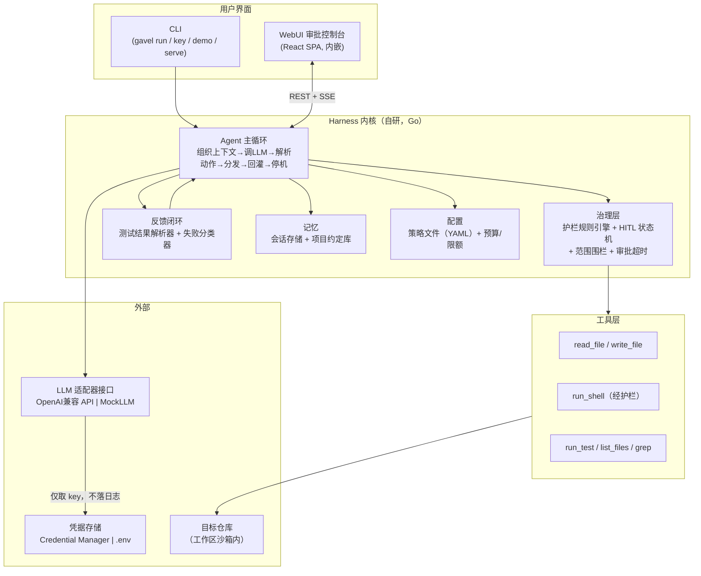
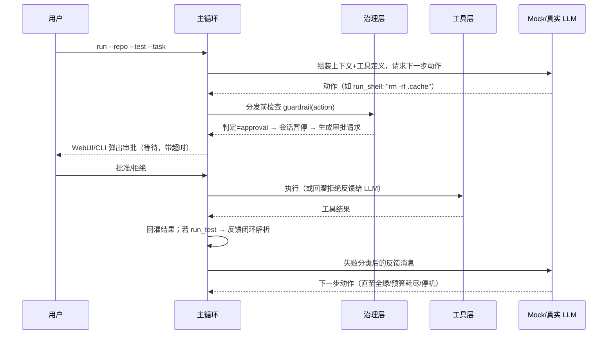
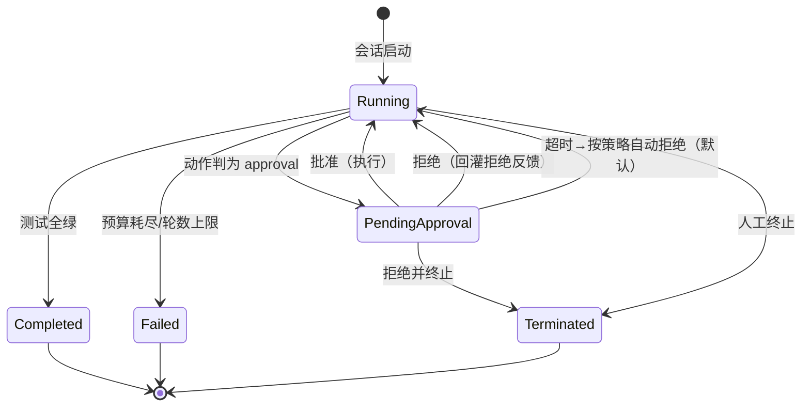
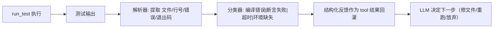

# Gavel — Coding Agent Harness 设计规约（SPEC）

> AI4SE 期末项目 · A · Coding Agent Harness
> 状态：已获用户逐节确认（brainstorming 产出）
> 项目代号：**Gavel**（法槌）——"LLM 提议，法槌裁决"

---

## 1. 问题陈述

**Gavel** 是一个以**治理（Governance）为核心**的自研 coding agent harness（即 `Agent = LLM + Harness` 中 harness 一层的代码实现）。它接受一个代码仓库与一个失败测试目标，自主循环"读代码 → 改代码 → 跑测试 → 解析失败 → 回灌修正"，直到测试全绿或预算耗尽；在此过程中，所有危险动作都经过**确定性代码实现的护栏**拦截与**人工审批（HITL）**。

- **目标用户**：想为 CI 里"跑挂的简单回归测试"找自动修理工、但不信任黑盒自动改代码的个人开发者与小团队；以及想研究 agent 治理机制的学习者。
- **为什么值得做**：市面 coding agent 的护栏多为提示词级约束（是否拦截取决于 LLM 是否遵从，不可测试）。Gavel 把拦截与审批做成确定性代码机制——移除 LLM 后仍可用 mock 驱动单元测试验证。同时它是一台可观测的机器：审批控制台让"agent 想干什么危险的事"变成可见、可审计、可控制的事件流。
- **一句话定位**：一个能修测试、但危险动作必须先过人工审批的透明 coding agent。

## 2. 用户故事（INVEST）

| # | 故事 | 验收要点 |
|---|---|---|
| US-1 | 作为开发者，我运行 `gavel run --repo ./myrepo --test "go test ./..." --task "修复失败测试"`，让 agent 开始自主修复，并在 WebUI 看到会话实时状态。 | 会话创建、循环推进、状态在 UI 可见 |
| US-2 | 作为开发者，当 agent 尝试执行 `rm -rf` 等危险命令时，会话暂停，我在审批控制台看到风险详情，可批准 / 拒绝 / 拒绝并终止。 | 护栏判定 `approval`，HITL 三选项生效 |
| US-3 | 作为开发者，我能实时看到测试失败如何被解析为结构化反馈、agent 如何据此改变下一步动作，直到测试变绿。 | 失败解析器输出回灌，行为可追溯 |
| US-4 | 作为新用户，首次运行按提示隐藏输入 API key，存入 Windows Credential Manager；`gavel key status` 只显示掩码与存储位置。 | key 隐藏录入、掩码显示、无明文 |
| US-5 | 作为评审者/助教，我 `docker pull` 并 `docker run`，或打开 Render 公网 URL 即可使用审批控制台，无需本地安装。 | 容器单命令可跑、公网 WebUI 可用 |
| US-6 | 作为学习者，我运行 `gavel demo`（纯 mock LLM），确定性复现护栏拦截、失败反馈改变动作、HITL 超时自动拒绝。 | 三场景输出断言全绿，无网络依赖 |

## 3. 功能规约

### 3.1 模块总览（9 个职责模块）

| 模块 | Go 包路径 | 职责 |
|---|---|---|
| 主循环 core | `internal/core` | agent 主循环、停机判断、预算管理 |
| LLM 层 llm | `internal/llm` | LLM 抽象接口 + OpenAI 兼容适配器 + MockLLM |
| 工具层 tools | `internal/tools` | 文件读写 / shell / run_test + 范围围栏 |
| 治理层 govern | `internal/govern` | 护栏规则引擎 + HITL 状态机 + 审批存储（**主贡献**） |
| 反馈闭环 feedback | `internal/feedback` | 测试输出解析器 + 失败分类器 + 反馈消息构造 |
| 记忆 memory | `internal/memory` | 会话存储 + 项目约定库 + 按需装配 |
| 配置 config | `internal/config` | 策略/预算/模型配置加载（YAML） |
| 凭据 secret | `internal/secret` | keyring / .env 存取 + 录入/掩码/清除 |
| 服务 server | `internal/server` | REST + SSE + 静态内嵌 WebUI |
| CLI | `cmd/gavel` | `run / demo / serve / key / status` 子命令 |

### 3.2 CLI 功能规约

**`gavel run`**
- 输入：`--repo <路径>`（必填）、`--test "<测试命令>"`（必填）、`--task "<自然语言任务>"`（必填）、`--model`、`--max-turns`（默认 20）、`--timeout`（会话总时长预算，默认 15 分钟；与审批超时无关，审批超时见 §6.3 由 policy 配置）、`--policy <yaml>`（可选，覆盖默认护栏策略）
- 行为：创建 Session → 进入主循环（见 §6）→ 每轮 Step 落盘 → 状态实时推送 SSE
- 输出：会话 id + 终态（completed/failed/terminated）+ 摘要；退出码 0=全绿，1=预算耗尽，2=人工终止，3=配置错误
- 边界条件：repo 不存在 → 立即报错退出；未配置 key 且未提供 `.env` → 引导 `gavel key set`
- 错误处理：LLM 调用失败 → 按指数退避重试 2 次 → 失败则会话置 failed

**`gavel demo`**（机制演示，§A.6）
- 输入：无（可选 `--json` 输出机器可读结果）
- 行为：用 MockLLM 依次执行三个确定性场景（见 §6.4），每个场景带断言
- 输出：三个场景各自的 PASS/FAIL 与事件轨迹；任一 FAIL 则退出码非 0
- 约束：不联网、不读任何凭据

**`gavel serve`**
- 输入：`--port`（默认 8080）、`--host`
- 行为：启动 REST + SSE 服务，托管内嵌 WebUI；云端模式从 `.env` 读 key
- 边界条件：端口占用报错退出；无 key 时服务可启动但会话无法开跑，UI 显示引导

**`gavel key set|status|clear`**
- `set`：终端隐藏输入（`golang.org/x/term` 读密码），写入 keyring（服务名 `gavel`）
- `status`：只显示 provider 名、掩码（`sk-...a1b2`）、存储位置（keyring/.env）、指纹（sha256 前 8 位）；**绝不回显明文**
- `clear`：删除 keyring 条目，并提示检查 `.env`
- 错误处理：keyring 不可用（如 Linux 无 dbus）→ 提示改用 `.env` 并说明风险

### 3.3 工具功能规约（agent 可用的动作）

| 工具 | 输入 | 行为 | 输出 | 边界 |
|---|---|---|---|---|
| `read_file` | 相对路径（+可选行范围） | 读仓库内文件 | 内容或错误 | 越出 repo 根 → 围栏拒绝 |
| `write_file` | 相对路径 + 内容 | 覆盖写入（父目录自动创建） | 写入字节数 | 越界拒绝；目标为 `.gavel/` 或 policy 文件 → `approval` |
| `run_shell` | 命令字符串 | 经护栏判定后执行，工作目录=repo 根，超时 60s | stdout+stderr+退出码 | 危险命令见 §6.2 |
| `run_test` | （可选测试命令覆盖） | 执行会话配置的测试命令，超时 300s | 原始输出 + 结构化 TestFailure 列表（由 feedback 解析） | 输出截断至 64KB 回灌 |
| `list_files` | 相对目录 | 列目录（跳过 .git） | 条目列表 | 越界拒绝 |
| `grep` | 模式 + 相对目录 | 文本搜索 | 匹配行（限制 200 条） | 越界拒绝 |

所有工具结果一律回灌给 LLM（含拒绝原因），这是反馈闭环的一部分。

### 3.4 WebUI 功能规约

- **审批控制台**：列出 pending 审批（动作、命中规则、风险描述、超时倒计时）；按钮：批准 / 拒绝 / 拒绝并终止
- **会话监控**：会话列表 + 单会话 Step 流水（LLM 消息摘要、动作、护栏判定、工具结果、反馈摘要），SSE 实时更新，兜底 2s 轮询
- **凭据面板**：显示 `key status` 同等信息（掩码/位置），不提供 key 展示与录入功能（录入走 CLI 隐藏输入，避免 Web 明文传输）
- **机制演示页**：调用 `gavel demo --json` 并渲染三个场景结果

### 3.5 记忆功能规约

- **会话存储**：`~/.gavel/sessions/<id>.json`，含 Session + 全部 Step（可审计）
- **项目约定库**：`~/.gavel/memory/<repo_hash>.json`，记录该仓库的历史决策（如"测试命令已确认为 xx"）
- **按需装配**：每轮发给 LLM 的上下文 = 系统提示 + 最近 5 轮消息 + 当前失败反馈 + 匹配的项目约定片段；**不**全量载入历史
- **审批记忆**（治理联动）：同一会话内，若某命令指纹（归一化命令哈希）已被批准过，后续相同命令自动放行

## 4. 非功能性需求

### 4.1 性能
- 单轮循环（不含 LLM 调用）：< 50ms；工具执行按其自身超时
- SSE 事件从动作判定到 UI 到达：< 500ms（本地）
- 会话存储单文件 < 10MB（Step 超限后只存摘要）

### 4.2 安全（含凭据威胁模型）

**威胁模型**（攻击者视角）：
| 威胁 | 对策 |
|---|---|
| 同机恶意进程读取凭据 | key 存 OS keyring（Credential Manager，加密、需用户会话） |
| key 写入日志 / 终端 history | 全链路日志脱敏（key 只以掩码出现）；CLI 隐藏输入；不使用 export |
| key 误提交进 git | `.gitignore` 含 `.env`；CI 增加 `git log -S` 泄露扫描 job；keyring 不落仓库 |
| agent 把 key 写进仓库文件 | 护栏规则：写文件/命令参数内容疑似 key（对比存储 key 的指纹）→ `deny` |
| WebUI 泄露 key | UI 只读掩码；录入仅走 CLI；SSE/REST 不含 key 字段 |
| `.env` 明文风险 | 仅云端容器模式使用；README 与 SPEC 明示"进程环境可见、文件明文" |

**要求**：key 绝不硬编码、绝不进 git（含历史）、绝不进日志；`key status` 无明文。

### 4.3 可用性
- 首次运行 ≤ 3 条命令内可跑通（key set → run）
- CLI 错误信息给出可操作建议；`gavel demo` 零配置可跑

### 4.4 可观测性
- 每个 Step 记录：时间戳、动作、护栏判定与命中规则、工具结果摘要、token 用量估算
- 结构化日志（JSON）到 stderr；WebUI 展示同源事件

## 5. 系统架构

### 5.1 组件图



### 5.2 数据流（一次完整迭代）



### 5.3 外部依赖

| 依赖 | 用途 | 理由 |
|---|---|---|
| LLM 供应商（OpenAI 兼容端点） | 真实模式决策 | base_url/model 可配置；支持 DeepSeek/GLM/Ollama/vLLM 等 |
| `go-keyring` | 桌面凭据安全存储 | 跨平台接 OS keyring |
| `gopkg.in/yaml.v3` | 策略与配置解析 | 声明式护栏规则 |
| React + Vite + shadcn/ui（Open Design） | WebUI | 见 §8 |
| Render / Docker | 云端部署 | 见 §7 |

**明确不使用**：任何 agent 编排框架（LangChain AgentExecutor、AutoGen、CrewAI、LlamaIndex agent 等）；LLM 调用只用标准库 `net/http` 直连单次对话补全 API。

### 5.4 数据模型

- **Session**：`id`、`repo` 路径、`task` 描述、`testCmd`、状态（running/pending_approval/completed/failed/terminated）、预算（`maxTurns`/会话总时长）、开始/结束时间。约束：id 唯一；状态只能按 §6.3 状态机迁移。
- **Step**（会话内一轮）：`seq`、`llmMessages` 摘要、动作（tool 名 + 参数）、护栏判定（allow/deny/approval + 命中规则）、工具执行结果、反馈摘要、时间戳。关系：Step N+1 依赖 Step N 的反馈（会话内有序）。
- **Approval**：`id`、`sessionID`、动作、命中规则、风险描述、状态（pending/approved/denied/timeout）、请求/决定时间戳、决定来源（CLI/WebUI/超时）。约束：同一会话同一时间至多一个 pending。
- **MemoryEntry**：`key`（如 `project:<repoHash>`）、类型（约定/决策）、内容、更新时间。约束：按需装配，不随会话全量注入。
- **CredentialRef**：provider、存储位置（keyring/.env）、掩码、指纹（sha256 前 8 位，仅用于状态显示与泄露比对）。约束：实体中不含明文 key。

## 6. 领域与机制设计（§A.5，重点章节）

### 6.1 领域（coding）的四类机制回答

- **动作/工具**：读文件、写文件、跑 shell、跑测试、列目录、搜索（§3.3）
- **客观反馈信号**：测试命令的输出与退出码 → 由确定性解析器转为结构化 `TestFailure{File, Line, Message, Kind}`；kind ∈ {编译错误, 断言失败, 超时, 环境缺失, 未知}
- **危险动作**：破坏性 shell（`rm -rf`、`git reset --hard`、`git push --force`、磁盘格式化、数据库删除）、外发网络命令（`curl|sh` 等）、写越界文件、修改护栏自身配置、疑似密钥写入
- **记忆需求**：会话历史（审计）、项目约定（跨会话复用）、审批过的命令指纹（会话内免重复审批）

**重点维度 = 治理**。理由：① 最符合 §A.4(B)(C) 判据——`guardrail(action)` 对构造动作的判定完全确定、可用 mock 测试；② 与必交 WebUI 天然配对（审批控制台）；③ 机制演示 ①③ 直接对齐。反馈闭环作为第二梯队扎实实现（演示②依赖它）。

### 6.2 护栏规则引擎（确定性代码，可配置）

每个动作分发前被规则引擎逐条判定，返回三态：

| 判定 | 含义 | 后续 |
|---|---|---|
| `allow` | 安全 | 直接执行 |
| `deny` | 明确禁止 | 不执行，拦截结果回灌 LLM，会话继续 |
| `approval` | 危险但可批准 | 会话暂停 → HITL 审批 |

内置规则（`policy.yaml` 声明式配置，规则引擎本身是代码）：
1. 危险命令模式（正则 + 归一化）→ `approval`：`rm -rf` / `rm -fr` / `del /s`、`git push --force`、`git reset --hard`、`git clean -fdx`、`curl … | sh`、`DROP DATABASE`、`mkfs`、`format c:`
2. 外发网络命令（`curl`/`wget`，非白名单域）→ `approval`
3. 密钥泄露检测：动作参数/文件内容与已存 key 的指纹比对命中 → `deny`
4. 范围围栏：路径归一化 + symlink 解析后越出 `--repo` 根 → `deny`
5. 修改护栏自身（写仓库内 `.gavel/` 目录、覆盖会话使用的 policy 文件）→ `approval`（注：`~/.gavel/` 为 harness 全局数据目录，不在仓库内，不受此规则管辖）

**实现要点**：`Guardrail(action, policy, ctx) → Verdict{allow|deny|approval, matchedRule}`；测试直接构造 `Action{Command: "rm -rf /"}` 断言 `approval`，构造 `Action{Path: "../../etc/passwd"}` 断言 `deny`，**全程无 LLM**。

### 6.3 HITL 状态机（治理深度核心）



- 审批请求字段：id、session、动作、命中规则、风险描述、创建时间、超时（由 `policy.yaml` 的 `approval_timeout` 配置，默认 5 分钟）
- 超时策略默认**自动拒绝**并回灌反馈（fail-closed）；可配置为自动批准（fail-open，默认关闭）
- 审批通道：WebUI（SSE 通知 + REST 决定）或 CLI（交互式 y/n）；两者共享同一审批存储
- 同一会话内已批准命令指纹自动放行（记忆联动）

### 6.4 反馈闭环（第二梯队）



- 解析器吃纯文本，产出结构化 `TestFailure` 列表——对构造文本可确定性断言（go 测试输出、pytest 输出两套模式起步）
- 分类决定回灌消息写法：编译错误附错误行上下文；断言失败附期望 vs 实际
- **停机判断**：退出码 0 且无失败 → Completed；连续 3 轮相同失败指纹 → 提前 Failed（防死循环）；轮数/时间预算耗尽 → Failed

### 6.5 主循环伪代码（自研，不用任何框架）

```
loop:
  messages = assemble(systemPrompt, last5, feedback, memoryHints)
  resp = llm.Complete(messages, tools)          # 单次补全
  if resp.done: break
  for call in resp.toolCalls:
    verdict = guardrail(call.action)
    if verdict == approval:
      decision = hitl.await(call, timeout)      # 阻塞/异步等审批
      if decision != approved: feedback += denyMsg; continue
    result = tools.dispatch(call.action)        # 围栏在工具层二次校验
    if call.tool == run_test:
      feedback = parser.parse(result.output)    # 确定性解析
      if allGreen: state=completed; break
    messages += toolResult
  if turns > maxTurns or timeBudgetExceeded: state=failed; break
```

**§A.4 合规性**：(A) 主循环、工具分发、治理、反馈均为自写代码，LLM 仅单次补全；(B) 反馈信号与危险动作拦截均为确定性代码机制；(C) 每个机制注入 MockLLM 后可用单测验证；(D) 六维度最低实现 + 治理做深。

### 6.6 机制演示剧本（§A.6，`gavel demo`）

在纯 MockLLM（脚本化动作序列，无网络、无凭据）下确定性复现：
1. **①护栏拦截 + ③重点维度**：mock 发出 `run_shell: "rm -rf ."` → 判定 `approval` → 审批超时（demo 中压缩为 1 秒）→ 自动拒绝 → 拒绝反馈回灌 → 会话继续
2. **②反馈闭环**：mock 发出 `write_file` → 随后 `run_test` 返回注入的失败文本 → 解析器产出结构化失败 → mock 收到反馈后发出"修复该文件"的 `write_file` 动作
3. 断言：三场景全部通过（`gavel demo --json` 输出 PASS，退出码 0）

## 7. 凭据与分发设计

### 7.1 凭据方案

- **桌面（二进制）**：`gavel key set` 隐藏输入 → `go-keyring` 写入 **Windows Credential Manager**（macOS Keychain / Linux Secret Service 自动适配），服务名 `gavel`
- **云端（容器）**：keyring 不可用 → 回退 `.env` 文件加载（README/SPEC 明示明文风险）；Render 环境变量注入
- **读取优先级**：keyring → `.env` → 环境变量（仅作最后兜底，文档说明）
- **状态**：`gavel key status` 只回显 provider、掩码、位置、指纹
- **清除**：`gavel key clear` 删 keyring 条目 + 提示检查 `.env`

### 7.2 分发形态（双形态）

1. **原生单文件二进制**：goreleaser 交叉编译 Windows/Linux/macOS（amd64），未签名；README 说明 Windows SmartScreen 首次运行拦截的处理（"更多信息 → 仍要运行"）；CI 产出 release artifacts
2. **Docker 镜像**：多阶段构建（前端构建 → Go 构建 → distroless 运行时），推送 ghcr.io；`docker pull` + `docker run -p 8080:8080 -e LLM_API_KEY=...` 单命令可跑
3. **云端部署**：Render Free Web Service，用 Dockerfile 部署，公网 URL 提供 WebUI；README 写清部署架构、环境变量配 key、已知限制（免费实例闲置冷启动 ~30s）

### 7.3 CI 设计

- GitHub Actions：`unit-test` job（`go test ./...`，全离线，含 mock-LLM 单测 + `gavel demo` 断言）+ `docker-build` job（构建镜像 + push ghcr.io）+ `release` job（goreleaser 产二进制）
- `.gitlab-ci.yml`：包含名为 `unit-test` 的 job（满足交付清单第 6 条）
- 泄露扫描：`git log -S` / grep 检查历史中无真实 key

## 8. 技术选型与理由

| 选型 | 理由 |
|---|---|
| **Go** | 单静态二进制分发最干净；`go-keyring` 直连 Windows Credential Manager；`go test` 天然支持 mock 注入；对齐 Copilot CLI 的 CLI-harness 路线；subagent 开发效率高于 Rust |
| **LLM 适配**：单一 OpenAI 兼容 `/v1/chat/completions` + 工具调用，标准库 `net/http` 直连 | 一个适配器覆盖主流供应商与本地 Ollama；不用 SDK/框架，符合 §A.4 边界；动作以结构化 tool_calls 返回，解析全自控 |
| **LLM 供应商**：默认 DeepSeek（`deepseek-chat`，OpenAI 兼容端点 `https://api.deepseek.com`），base_url/model 可配置 | 性价比高、国内直连、支持工具调用；代码不绑定任何供应商 |
| **WebUI**：React + Vite（构建产物 `go:embed` 内嵌） | 业界主流"后端核心 + TS 前端"形态；单文件可携带；SSE 实时审批推送（兜底轮询） |
| **Open Design**：使用其 **shadcn/ui** 设计系统与 skill | 满足 §3.6 条件要求；审批控制台用 shadcn/ui 组件（Dialog/Badge/Tabs 等）实现，风格统一 |
| **凭据**：go-keyring + .env 回退 | OS 级安全 + 云端容器可行；威胁模型清晰 |
| **部署**：Render（Free，Docker 原生，无需绑卡） | 免费可公开访问；Railway 为替补方案 |
| **测试**：`go test`（表驱动）+ 表驱动 mock | 一键 `make test` 全离线 |

## 9. 验收标准（客观判定）

1. **mock-LLM 确定性单测全绿**（`go test ./...`，无网络）：覆盖主循环停机、工具分发、护栏三态（构造 `rm -rf` → approval；越界路径 → deny）、HITL 超时自动拒绝、范围围栏、测试解析器、失败分类、记忆读写、审批记忆
2. **`gavel demo` 三场景断言全绿**（§A.6 ①护栏拦截 ②失败改动作 ③重点维度超时自动拒绝），退出码 0，离线运行
3. **真实 LLM 手动验收**：`gavel run` 对样例仓库（含种子 bug）完成失败 → 全绿至少一次（人工记录，不进 CI）
4. **凭据安全**：`key set/status/clear` 流程可用且 status 无明文；仓库全历史无真实 key；CI 泄露扫描通过
5. **CI/CD**：unit-test job 通过；Docker 镜像构建并推送成功；最后一次 CI 执行 pass
6. **部署**：Render 公网 URL 打开 WebUI 可用（审批控制台 + 会话监控 + 演示页）
7. **文档**：README（简介/安装/运行/分发/目录结构/安全边界）、SPEC、PLAN、SPEC_PROCESS、AGENT_LOG、REFLECTION 齐全

## 10. 风险与未决问题

| # | 风险 | 对策 |
|---|---|---|
| 1 | 真实 LLM 输出不稳定 | 演示与 CI 以 mock 为准；真实 run 仅人工验收，不阻塞 CI |
| 2 | go-keyring 在 Linux 容器无 dbus | 容器模式自动走 `.env` 路径，SPEC/README 明示 |
| 3 | SSE 经 Render 反代被缓冲 | 设置 `X-Accel-Buffering: no` + 前端 2s 轮询兜底 |
| 4 | subagent 把护栏写成提示词 | PLAN 中每个治理 task 的验证步骤强制为"构造动作→断言拦截"的代码测试（§A.4-C 判据写进 task 描述） |
| 5 | 测试输出格式多样导致解析失败 | 起步支持 go test 与 pytest 两种模式，其余归入 `未知` 分类并原样回灌 |
| 6 | ~~未决：LLM 供应商~~ **已决**：真实验收使用 **DeepSeek**（`deepseek-chat`），key 通过 `gavel key set` 录入 | DeepSeek 走 OpenAI 兼容适配器，零额外代码 |
| 7 | ~~未决：GitHub 仓库~~ **已决**：`https://github.com/166176/harness.git`（公开仓；若改私有需加助教协作者） | 需在首次推送前配置真实 git 身份 |
